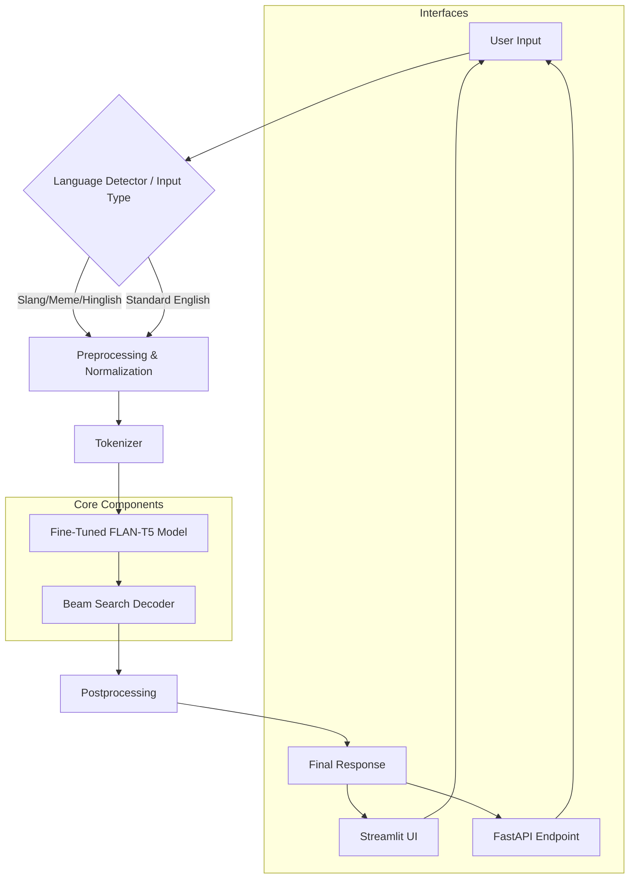

# Project Architecture

This document describes the high-level architecture and the data pipeline of the Cross-Language Meme & Slang Translator.

## 🏗️ Pipeline Architecture

The system follows a standard NLP translation pipeline, optimized for informal and code-mixed (Hinglish) text.

## 🛠️ Component Details

### 1. User Input
The system accepts text inputs that can be:
- Gen-Z Slang (e.g., "no cap", "rizz")
- Hinglish (e.g., "kya scene hai bro")
- Standard English (for reverse translation)

### 2. Preprocessing & Normalization
- **Hinglish Normalizer**: Handles common code-mixing patterns and phonetic variations.
- **Slang Cleaner**: Standardizes common internet abbreviations and removes excessive punctuation or emojis if they interfere with translation.

### 3. Tokenizer
Uses the `T5TokenizerFast` from the Hugging Face library, which is compatible with the `google/flan-t5-small` architecture.

### 4. Fine-Tuned FLAN-T5
The heart of the project is a `FLAN-T5-small` model fine-tuned on a specialized parallel corpus. It is capable of understanding task prefixes to switch between forward (Slang → Standard) and reverse (Standard → Slang) modes.

### 5. Beam Search Decoder
During inference, we use Beam Search (width=6) to ensure the generated translation is coherent and contextually accurate, rather than just choosing the most likely next word (greedy).

### 6. FastAPI Backend
A production-ready wrapper that serves the model over HTTP, allowing other applications or services to integrate the translation capabilities.

## 📈 Data Flow
1. **Request**: The user sends a string and a translation direction.
2. **Process**: The string is normalized, tokenized, and passed to the T5 model.
3. **Generate**: The model generates a sequence of tokens based on the fine-tuned weights.
4. **Respond**: The tokens are decoded into a readable string and returned to the user.
